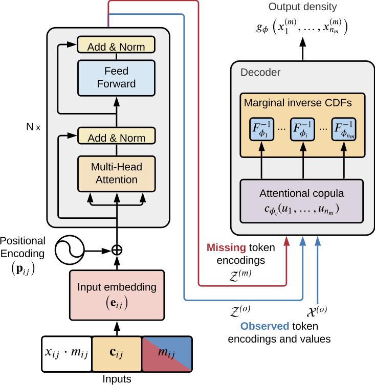

# TACTiS: Transformer-Attentional Copulas for Time Series

Alexandre Drouin, Étienne Marcotte, Nicolas Chapados (2022). [TACTiS: Transformer-Attentional Copulas for Time Series](https://proceedings.mlr.press/v162/drouin22a.html). *International Conference on Machine Learning* (ICML 2022).

> The estimation of time-varying quantities is a fundamental component of decision making in fields such as healthcare and finance. However, the practical utility of such estimates is limited by how accurately they quantify predictive uncertainty. In this work, we address the problem of estimating the joint predictive distribution of high-dimensional multivariate time series. We propose a versatile method, based on the transformer architecture, that estimates joint distributions using an attention-based decoder that provably learns to mimic the properties of non-parametric copulas. The resulting model has several desirable properties: it can scale to hundreds of time series, supports both forecasting and interpolation, can handle unaligned and non-uniformly sampled data, and can seamlessly adapt to missing data during training. We demonstrate these properties empirically and show that our model produces state-of-the-art predictions on multiple real-world datasets.

<br />
<p align="center">
  
</p>


## Citing this work

Please use the following Bibtex entry to cite TACTiS.

```
@InProceedings{pmlr-v162-drouin22a,
  title = 	 {{TACT}i{S}: Transformer-Attentional Copulas for Time Series},
  author =       {Drouin, Alexandre and Marcotte, \'Etienne and Chapados, Nicolas},
  booktitle = 	 {Proceedings of the 39th International Conference on Machine Learning},
  pages = 	 {5447--5493},
  year = 	 {2022},
  editor = 	 {Chaudhuri, Kamalika and Jegelka, Stefanie and Song, Le and Szepesvari, Csaba and Niu, Gang and Sabato, Sivan},
  volume = 	 {162},
  series = 	 {Proceedings of Machine Learning Research},
  month = 	 {17--23 Jul},
  publisher =    {PMLR},
  pdf = 	 {https://proceedings.mlr.press/v162/drouin22a/drouin22a.pdf},
  url = 	 {https://proceedings.mlr.press/v162/drouin22a.html}
}
```
