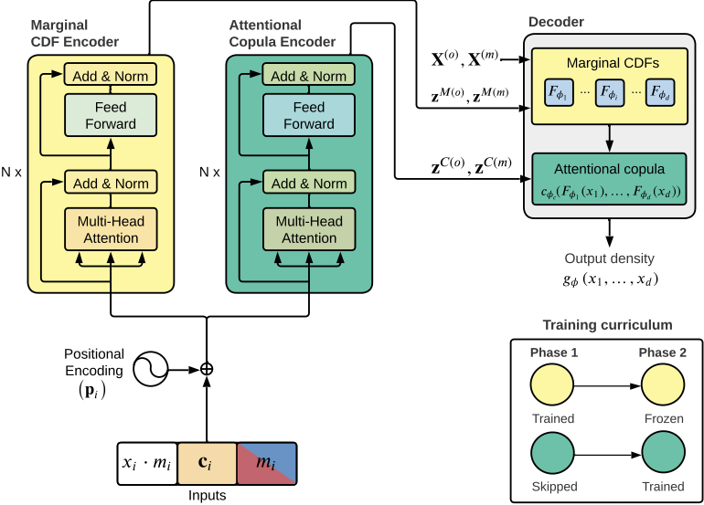

# TACTiS-2: Better, Faster, Simpler Attentional Copulas for Multivariate Time Series

Alexandre Drouin, Étienne Marcotte, Nicolas Chapados (2023). *TACTiS-2: Better, Faster, Simpler Attentional Copulas for Multivariate Time Series*. (Preprint)

> We introduce a new model for multivariate probabilistic time series prediction, designed to flexibly address a range of tasks including forecasting, interpolation, and their combinations. Building on copula theory, we propose a simplified objective for the recently-introduced transformer-based attentional copulas (TACTiS), wherein the number of distributional parameters now scales linearly with the number of variables instead of factorially. The new objective requires the introduction of a training curriculum, which goes hand-in-hand with necessary changes to the original architecture. We show that the resulting model has significantly better training dynamics and achieves state-of-the-art performance across diverse real-world forecasting tasks, while maintaining the flexibility of prior work, such as seamless handling of unaligned and unevenly-sampled time series.

<br />
<p align="center">
  
</p>


For an implementation of the original version of TACTiS, please see [here](https://github.com/ServiceNow/tactis/tree/v1.0.0).

**We are preparing the TACTiS-2 code for release. Please check back later and contact us if you require early access.**


## Citing this work

Please use the following Bibtex entry to cite TACTiS-2.

```
Coming soon!
```


## Vulnerability Reporting
Please notify psirt-oss@servicenow.com regarding any vulnerability reports in addition to following current reporting procedure.
